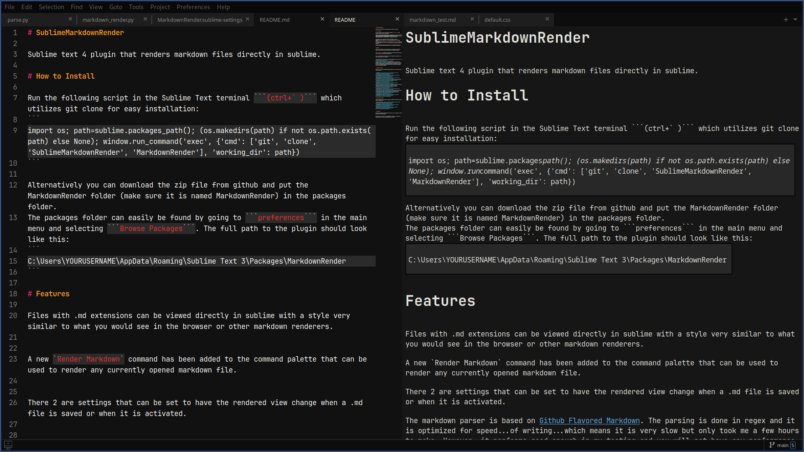
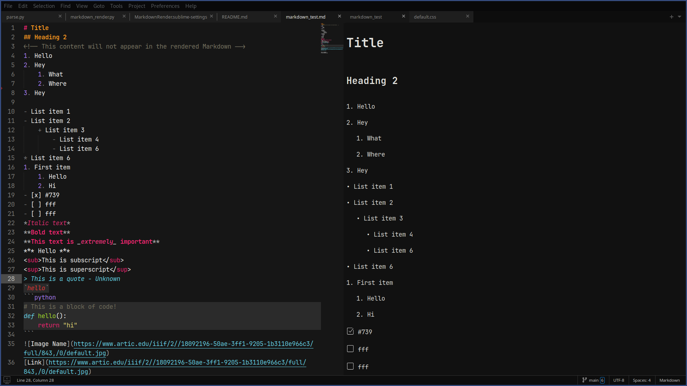
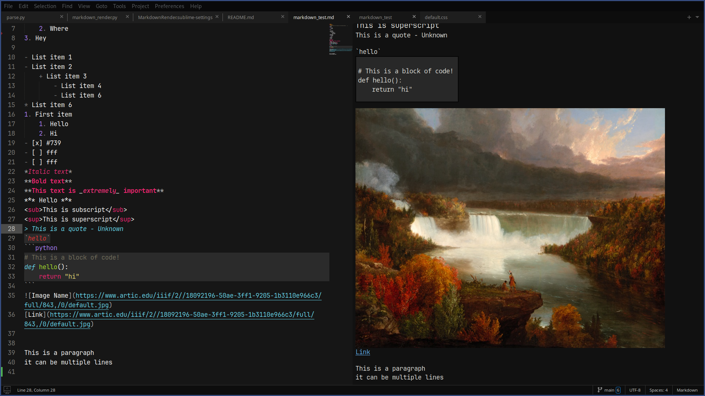

# SublimeMarkdownRender

Sublime text 4 plugin that renders markdown files directly in sublime.

# How to Install

Run the following script in the Sublime Text terminal ```(ctrl+` )``` which utilizes git clone for easy installation:
```
import os; path=sublime.packages_path(); (os.makedirs(path) if not os.path.exists(path) else None); window.run_command('exec', {'cmd': ['git', 'clone', 'SublimeMarkdownRender', 'MarkdownRender'], 'working_dir': path})
```

Alternatively you can download the zip file from github and put the MarkdownRender folder (make sure it is named MarkdownRender) in the packages folder.
The packages folder can easily be found by going to ```preferences``` in the main menu and selecting ```Browse Packages```. The full path to the plugin should look like this:
```
C:\Users\YOURUSERNAME\AppData\Roaming\Sublime Text 3\Packages\MarkdownRender
```

# Features

Files with .md extensions can be viewed directly in sublime with a style very similar to what you would see in the browser or other markdown renderers.


A new `Render Markdown` command has been added to the command palette that can be used to render any currently opened markdown file.


There 2 are settings that can be set to have the rendered view change when a .md file is saved or when it is activated. There is another settings that will have a newly rendered markdown file open in the same group as the currently opened tab.


The markdown parser is based on [Github Flavored Markdown](https://docs.github.com/en/get-started/writing-on-github/getting-started-with-writing-and-formatting-on-github/basic-writing-and-formatting-syntax). The parsing is done in regex and it is optimized for speed...of writing...which means it is very slow but only took me a few hours to make. However, it performs good enough in my testing and you will not have any performance issues with small files but with 1000+ line markdown files you might notice slowdowns.


# Implemented Features

These are the currently implemented markdown features, not all of them are done yet but most are.


- [Headings](https://docs.github.com/en/get-started/writing-on-github/getting-started-with-writing-and-formatting-on-github/basic-writing-and-formatting-syntax#headings)
- [Text Styling](https://docs.github.com/en/get-started/writing-on-github/getting-started-with-writing-and-formatting-on-github/basic-writing-and-formatting-syntax#styling-text)
- [Quoting Text](https://docs.github.com/en/get-started/writing-on-github/getting-started-with-writing-and-formatting-on-github/basic-writing-and-formatting-syntax#quoting-text) (single ticks are TODO still)
- [Links](https://docs.github.com/en/get-started/writing-on-github/getting-started-with-writing-and-formatting-on-github/basic-writing-and-formatting-syntax#links)
- [Images](https://docs.github.com/en/get-started/writing-on-github/getting-started-with-writing-and-formatting-on-github/basic-writing-and-formatting-syntax#images)
- [Lists](https://docs.github.com/en/get-started/writing-on-github/getting-started-with-writing-and-formatting-on-github/basic-writing-and-formatting-syntax#lists)
- [Nested Lists](https://docs.github.com/en/get-started/writing-on-github/getting-started-with-writing-and-formatting-on-github/basic-writing-and-formatting-syntax#nested-lists) - Still needs some improvement so each nesting level shows a different character for unordered lists.
- [Task Lists](https://docs.github.com/en/get-started/writing-on-github/getting-started-with-writing-and-formatting-on-github/basic-writing-and-formatting-syntax#task-lists)
- [Paragraphs](https://docs.github.com/en/get-started/writing-on-github/getting-started-with-writing-and-formatting-on-github/basic-writing-and-formatting-syntax#paragraphs)

# Todo Markdown Features

These are markdown features that are possible to implement in sublime but are not part of the plugin yet.


- [Section links](https://docs.github.com/en/get-started/writing-on-github/getting-started-with-writing-and-formatting-on-github/basic-writing-and-formatting-syntax#section-links)
- [Footnotes](https://docs.github.com/en/get-started/writing-on-github/getting-started-with-writing-and-formatting-on-github/basic-writing-and-formatting-syntax#footnotes)
- [Alerts](https://docs.github.com/en/get-started/writing-on-github/getting-started-with-writing-and-formatting-on-github/basic-writing-and-formatting-syntax#alerts)

# Limitations

Sublime text uses [minihtml](https://www.sublimetext.com/docs/minihtml.html) which has a very limited amount of css properties and html tags. This makes it challenging to correctly render markdown, some things that are easy in html aren't possible with minihtml. Most of this can be worked around in some way but others will appear different than typical markdown rendering.


- Strikthrough text - There is no support for this in minihtml so it will render as small text with italics instead.

- Codeblocks - Syntax highlighting in minihtml isn't really possible and the css for code blocks is kinda weird right now.

- Invalid html - If your markdown file has html tags in it then it will likely not render the tags correctly because sublime will think it is minihtml when the text is showed in the html sheet.

- Only png, jpg, and gif files can be rendered in sublime.

# Contributing

The plugin currently does everything I need it to do, so it is unlikely I will be making many new changes myself.


With that said, if you want to make improvements or changes pull requests are welcome and if you run into any problems open up an issue.




